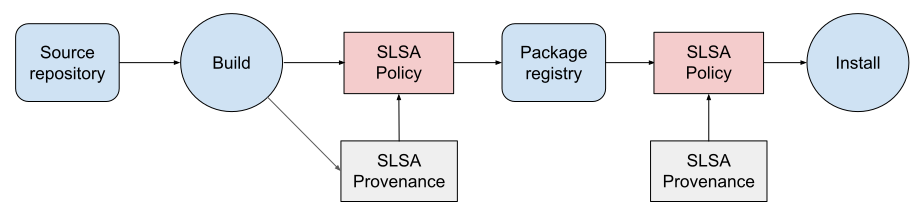

# Policy Architecture for Npm Package Provenance

*   Proposer: Wietse Venema ([wietse@gmail.com](mailto:wietse@gmail.com))
*   GitHub Issue: TODO
*   Status: [DRAFT](../README.md#meaning-of-status-codes)
*   Original link: [Google docs](https://docs.google.com/document/d/1ulft22Nv6OXFeVRIrVfH2bK4QcRyvv0RwDt2dhJltK4/edit?usp=sharing) (see there for reviewer comments and rejected ideas)

## Summary

This document proposes an architecture for policy evaluation over SLSA
provenance, for software packages that are managed with npm, the package manager
for Node.js. When npm installs a software package and its transitive
dependencies, it records the installed packages in a lock file
(package-lock.json). The information that is written to these files is a primary
input for a proposed SLSA provenance policy evaluator.

With few differences, the approach presented here is expected to generalize to
other lock file-based software environments such as Go (go.mod and go.sum), PHP
(composer.lock), Python (Pipfile.lock), and Ruby (Gemfile.lock).

## Objectives

Evaluate policies over SLSA provenance for npm software packages.

Non-objectives:

-  Policies for what direct or indirect package dependencies (or dependency
    versions) to expect for an npm software package; policies for vulnerability
    scans.

## Overview

Here, we highlight the main architecture elements, their roles, and limitations.
We present more detail in subsequent sections, with additional detail in the
Appendix.

### Extended software supply chain model

The figure shows a generic supply chain for software packages, from source repository
to installation, extended with two SLSA provenance policy evaluation points:

-  When a software package is published to a package registry.
-  When a software package is installed from a package registry.

A SLSA provenance policy contains expectations for provenance, as discussed in later
sections.

SLSA Provenance expectations may be evaluated at other points inside or outside
the above pipeline. Examples are a pre-build provenance check for build inputs,
or an organization-wide proxy that checks SLSA provenance for package downloads.
SLSA Provenance expectations may also differ between development versus
production environments, or private versus public registries. We will not cover
these differences in detail, but expect that the use cases can use similar SLSA
provenance expectations as described here.

### SLSA provenance expectations, benefits and limitations

Each SLSA provenance policy covers multiple versions for a specific package
name. For example, the policy for package ‘foo' could expect that each covered
version:

-  Has SLSA provenance that is signed with a key that is bound to a trusted
    identity. The key could be long-lived, rotated regularly, or ephemeral, and
    the identity could be a builder, individual, or organization.
-  The provenance contains claims that:
    -  Combined together satisfy the requirements for SLSA level X.
        -  A policy evaluator may limit the maximum SLSA level
            depending on the builder identity or other context. 

    -  The package was built from the repository
        [https://example.com/path/to/foo](https://example.com/path/to/foo).

-  Other provenance claims may be relevant for specific use cases.

When enforced, these expectations will ensure that a compromise of a package
registry upload credential (or a compromise of the registry itself) cannot
result in the installation of a rogue ‘foo' package version that was built from
an unexpected repository or with an unexpected builder. 

If a ‘good' package version does not meet policy expectations, the expectations
need to be updated for that package version and onwards, so that earlier package
versions will continue to pass expectations (different dependencies may require
different versions of a package).

These expectations cannot detect 'upstream' compromises, for example the
corruption of a build system, the exposure of a signing key, or a malicious
change to a source repository. 

### Expectations when publishing a package to a registry

A developer submits a new version of a package to a registry. A policy evaluator
at the registry verifies the signature on the SLSA provenance for that package,
and verifies that the provenance meets the provenance expectations for this
version of the package (one policy covers multiple versions of a specific
package).

Initially the policy evaluator will run pre-upload or post-upload, producing
alerts only, with expectations stored at the evaluator. For enforcement the
evaluator will need to be integrated into the package registry, and expectations
may become managed centrally.

A developer may also run a policy evaluator locally, with their own provenance
expectations, before attempting to submit their package to a registry.

An organization that uses a private registry may have different expectations and
verification than a public registry.

### Expectations when installing a package from a registry

A developer installs a software package as an application or library dependency,
or an end user installs an application package in a user directory. In both
cases the npm package manager installs transitive dependencies for the specified
package, and records each installed package in the local lock file
(package-lock.json).

A policy evaluator at the developer or end user applies a specific SLSA
provenance policy for each package version that is recorded in the local lock
file  (one policy covers multiple versions of a specific package).

Initially the policy evaluator will run post-installation, producing alerts
only, using expectations stored at the local evaluator instance. For enforcement
the evaluator will need to be integrated into the package installer, and
expectations may become managed centrally. 

### Generating provenance expectations

To overcome a bootstrapping problem, we assume that compromises will be rare,
and propose to generate package-specific SLSA provenance expectations on first
use. Each such ‘trust on first use' policy contains expectations based on
observed provenance, and can be used as a baseline to detect unexpected changes,
for example a too low SLSA level, missing provenance, or an unexpected change
in a 'sensitive' provenance property.

We expect that provenance expectations will initially be managed locally where
they are used: at the package developer, at the package registry, or at the
package user. We also expect that policies will initially be alerting only, i.e.
not enforcing.

As experience grows and confidence increases, we expect that policies will
evolve to become ‘enforcing', and that expectations may become managed
centrally.

## Background: npm 

[npm](https://www.npmjs.com/) is the package manager for Node.js software
packages. Of particular relevance for SLSA provenance policy evaluation are the
_package provenance_, _package content_, and (after installing a package) the
_package lock file_. We summarize main features and present some numbers based
on an analysis of the top-1000 npm packages ranked by the number of
dependents.

#### Package provenance

-  [npm RFC 626](https://github.com/npm/rfcs/pull/626) proposes to generate
    SLSA provenance attestations that will link an npm package to the source
    code that it was built from. The goal is SLSA level 3 for most packages.

#### Package content

Each npm package contains:

-  Package-specific code but no dependency code.
    -  Of the top-1000 npm packages, only the npm package manager
        contains its dependencies. This avoids a bootstrapping problem. 

-  A metadata file package.json with:
    -  Package name and version.
    -  Other information that we will not use such as dependency package
        names and version ranges.

#### Package lock file

-  When the npm package manager installs a package, it dynamically resolves
    dependency versions respecting the version patterns in each package.json
    file, downloads and installs transitive dependency packages, and updates a
    lock file package-lock.json with installed package names, concrete
    versions, and digests.
-  Less than 1% of the top-1000 npm packages contain a package-lock.json
    file. If the file is present, it will by default not affect what dependency
    versions "npm install" will install.

## Implementing provenance expectations 

There are multiple ways to implement expectations for provenance properties that
are not expected to change (including properties that are inferred from
provenance): do we remember 'good' property values, or do we remember 'good'
provenance? The difference is subtle.

#### Alternative 1: Remember expected provenance values 

With this alternative, the policy evaluator will compare selected properties of
a package's SLSA provenance against the expected property values for that
package. When a 'good' package's provenance causes an unexpected difference,
update the expected values.

#### Alternative 2: Remember expected provenance instances

Here, the policy evaluator will compare selected properties of a package's SLSA
provenance against property values in past 'good' provenance. When a 'good'
package's provenance causes an unexpected difference, remember the new ‘good'
provenance instance. 

#### Expectations for multiple package versions

A package dependency graph may require that multiple versions of the same
package will be installed. For this reason, when expectations need to be updated
for a package at a new version x.y.z (e.g., new source repository), then that
update must not invalidate previous ‘good' versions of that package. The
solution is to qualify expectations for a package with a version range.

-  With alternative 1,  different version number ranges correspond to
    different expected provenance values .
-  With alternative 2, different version number ranges correspond to
    different past ‘good' provenance instances.

#### Comparison of alternatives

-  Both alternatives could work whether managed locally and centrally. 
-  Both are compatible with the "trust on first use" approach described
    below, because both generate provenance expectations, based on:
    -  A configurable set of provenance properties that are not
        expected to change. This could be an organization-wide or even
        ecosystem-wide default setting.
    -  The content of a ‘good' provenance instance. 

I am inclined to prefer alternative 1, because it is more explicit about what
provenance will or will not be compliant. Alternative 2 may be preferable if
only information about the last package version needs to be remembered.

## Bootstrapping policy support

### Generating provenance expectations

To overcome a bootstrapping problem, we assume that compromises will be rare,
and propose to generate package-specific SLSA provenance expectations on first
use. Each such ‘trust on first use' (TOFU) policy contains expectations based on
observed provenance, and can be used as a baseline to detect unexpected changes,
for example a too low SLSA level, missing provenance, or an unexpected change in
a ‘sensitive' provenance property. A [proposed TOFU
policy](#a-proposed-tofu-policy-for-a-single-npm-package) is presented below.

### From local to centralized management

We expect that provenance expectations will initially be managed locally where
they are used: at the package developer before publishing to a registry, at the
package registry, or at the package user. As experience grows and confidence
increases, policies may be migrated to a central registry and managed there.

Future work is to implement centralized policy management.

### From alerting-only to enforcing

We expect that initially the policy evaluator will alert for an unexpected
change, and not block it.

-  An auditing policy can be evaluated post-upload and post-installation.
    This minimizes interference with existing npm tooling. 
-  An enforcing policy needs to be more tightly integrated with npm tools,
    so that it can block a non-compliant package.

Future work is to integrate the policy evaluator with npm tooling.

### A proposed TOFU policy for a single npm package

This is for a policy that lists explicit expectations for provenance values,
instead of expectations for what provenance fields are invariant (regardless of
their value).

Inputs: 

-  Package name and version.
-  Optional: verified package provenance.
-  Preferences. Examples include, but are not limited to:
    -  Names of 'sensitive' provenance properties that are not expected
        to change such as builder ID or source repository,
    -  Minimum SLSA level for an acceptable artifact, 
    -  Maximum SLSA level depending on the builder. 

-  Preferences may differ for different evaluator contexts: developer,
    registry, or end user, and for a private or public registry.

If no policy exists for this package, generate one with: 

-  Package name 
-  Version pattern that matches this package version and onwards.
-  Expected provenance properties (SLSA level, signer, builder, source repo,
    etc.).

If a policy already exists for this package:

-  Flag missing or unverifiable provenance.
-  Flag an unexpected change in a sensitive provenance property (SLSA level,
    source repo, etc.).

The following will require approval:

-  If a 'good' package version does not satisfy expectations, add new
    expectations, qualified with a version pattern that matches this package
    version and onwards.

## Main use cases

### Use case 1. Publishing a new package version

####  Existing process

-  A developer runs "npm publish" to submit a new version of their npm
    package to a registry.

#### New behavior

-  The package registry does a policy check for the package provenance,
    initially non-enforcing.
-  A private package registry may impose different expectations than a
    public one. 

#### New process

-  A developer may also do a policy check in preparation for package upload.

#### What packages will be covered by policy

-  The policy applies only to the package that is being published (the
    concrete versions of dependencies will be determined when a package is
    downloaded for installation).

####  Existing process details

-  Besides package-specific code, an npm package contains a metadata file
    (package.json) with the name and version of the package itself, and
    optionally the names and allowed version ranges of direct dependencies.
-  See "[Npm background](#heading=h.napkqzk41aim)" for more.

### Use case 2. Installing a package locally

The Appendix describes detailed scenarios to install packages and transitive
dependencies. Despite differences in purpose, many are identical from a policy
evaluation point of view:

-  Installing all package dependencies of a project (Appendix
    [A.1](#heading=h.vubk9ms4dtxh)).
-  Adding a new package dependency to a project (Appendix
    [A.2](#heading=h.vz2h8oar6gfd)).
-  Installing an npm application locally (Appendix
    [A.2](#heading=h.vz2h8oar6gfd)).

We summarize those commonalities here. For details see the Appendix.

#### Existing process

-  The commands "npm install" and "npm install \<package\>" install packages
    and transitive dependencies under the directory tree ./node_modules. They
    update a lock file (./package-lock.json) that enumerates each installed
    package (including packages that were already installed). 
-  The "npm ci" command takes a project-level lock file and populates a
    clean directory ./node_modules with all dependency versions listed in the
    lock file. 
-  Afterwards, for each installed package (dependent or dependency) the lock
    file contains:
    -  The package name, concrete package version, and package digest.
    -  The package's direct dependency names.
    -  Other information that we won't use.

#### What packages will be covered by policy

-  The policy applies to each installed package (listed in the lock file
    ./package-lock.json).
-  This includes packages that are installed as a dependent or as a
    transitive dependency. 

#### New behavior

After "npm install" updates the lock file, a post-installation policy evaluator
can simply iterate over the lock file and detect whether any installed
package:

-  Has missing provenance (if there is policy for that package that expects
    provenance).
-  Has a change in a sensitive provenance property.
-  Is a new dependency (i.e. it was not listed in an existing lock file).
    This could be logged, but may be noisy when software depends on a complex
    framework. For example a simple ‘react' application has over 3000
    transitive dependencies.

An enforcing policy evaluator would have to be integrated with "npm install" so
that it can block the installation of a non-compliant package.

## References

#### Lock file-based package management systems

-  [https://blog.shalvah.me/posts/understanding-lock files](https://blog.shalvah.me/posts/understanding-lockfiles)
    covers lock files in php, node.js (with npm and yarn), and in go and ruby.
-  [https://pypi.org/project/pipfile/0.0.2/](https://pypi.org/project/pipfile/0.0.2/)
    covers lock files for Python but is not yet official.
-  [https://classic.yarnpkg.com/lang/en/docs/yarn-lock/](https://classic.yarnpkg.com/lang/en/docs/yarn-lock/)
    covers lock files in Yarn (alternative Node.js package manager).

## Appendix

### A1. Installing dependencies in a repository clone or fork

####  Existing process

-  Many Node.js applications and libraries are developed using a
    source-code repository that contains no code for dependencies.
-  After cloning or forking a repository, a user or developer runs "npm
    install" (no additional arguments) to install all transitive dependencies
    inside the repository clone or fork. 
-  When a developer commits a code change, the source control system will
    ignore the code for dependencies. 

#### New behavior

-  The "npm install" command will do a policy check, initially
    post-installation.

#### What packages will be covered by policy

-  The policy applies to each installed package (listed in the lock file
    ./package-lock.json).
-  This includes packages that are installed as a transitive dependency. 
-  The policy does not apply to the repository clone or fork itself, because
    that code was not installed from an npm package.

####  Existing process details

-  Clone a repository for ‘foo' ("git clone –depth 1 https://site/foo"),
    fork a repository, or use some other process to check out or unpack that
    source code.
-  In the top-level directory for ‘foo', install transitive dependencies
    ("cd foo; npm install").
-  The command "npm install" (without package arguments) uses the file
    ./package.json to download transitive dependencies from a registry,
    installs them locally under the subdirectory ./node_modules, and records
    dependency names, concrete dependency versions, and dependency package
    digests, in the lock file ./package-lock.json.

### A2. Adding a dependency or installing a local application

#### Existing processes, high-level

-  A developer runs "npm install \<package\>" in an application or library
    top-level directory, to add a new dependency to their code.
-  An end user runs "npm install \<package\>" in a private directory to make
    an application's executable files ("binaries") available in that user's
    command search PATH.

#### New behavior

-  The "npm install" command will do a policy check, initially
    post-installation.
-  If a new direct dependency was added, the policy will need to be updated
    to expect that dependency.

#### What packages will be covered by policy

-  The policy applies to each installed package (listed in the lock file
    ./package-lock.json).
-  This includes packages that are installed as a dependent or as a
    transitive dependency.

####  Existing process details

We consider the usual case where the content of dependencies are not included in
a package.

Description of the existing processes:

-  The command "npm install foo" downloads package ‘foo' and its transitive
    dependencies from a registry, installs them under the subdirectory
    ./node_modules, and records the ‘foo' and concrete dependency versions and
    package digests in the lock file ./package-lock.json. Additionally, it adds
    the name ‘foo' and a version pattern to the list of direct dependencies in
    the file ./package.json. 
-  In the case of an application, "npm install foo" also creates symlinks in
    the directory ./node_modules/.bin to package ‘foo' executable files
    ("binaries") under the directory ./node_modules/foo/bin.

### A3. Installing an application globally

#####  Existing process

-  The command "npm install -g \<package\>" installs an application under a
    system directory so that its executable files ("binaries") become available
    to all users of that system.

#### New behavior

-  None.
-  As described under "[Details](#heading=h.kxd90egoe9lz)" below, global
    installs do not update a lock file (i.e. they record no concrete package
    versions, and no package digests). 
-  We defer policies for installs without package digests in lock files to
    future work. Such policies would not be able to support provenance checks.

#### What packages are covered by policy

-  None.

####  Existing process details

-  The command "npm install -g foo", downloads package ‘foo' and its
    transitive dependencies from a registry, installs all those packages
    together under a system directory such as /usr/local/lib/node_modules/foo,
    and creates symbolic links in a system directory such as /usr/local/bin to
    executable files ("binaries") under the directory
    /usr/local/lib/node_modules/foo/bin.
-  This does not write a lock file package-lock.json with concrete package
    versions and digests. Concrete package versions may still be found in
    individual package.json files under the /usr/local/lib/node_modules/foo
    directory tree.
